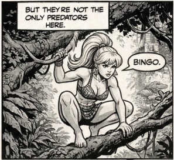
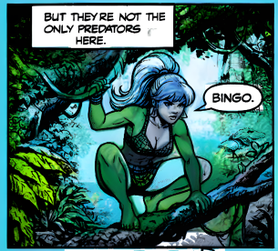
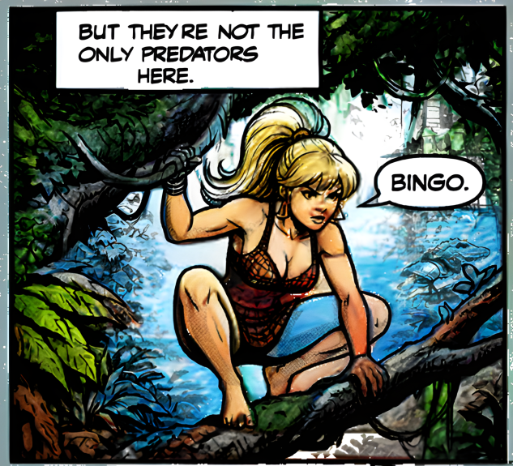

# 🦸‍♀️ Comic Book Auto-Colorizer (Kaggle Edition) 🎨

[](https://kaggle.com/)

An automated pipeline that takes black-and-white comic book archives (.cbz, .pdf) and outputs fully colorized, high-resolution versions. 

Because this script uses heavy AI models (Stable Diffusion, ControlNet, IP-Adapter, EasyOCR, and Real-ESRGAN), running it on a standard laptop will likely crash. **This project is designed to be run for free on [Kaggle](https://www.kaggle.com/) using their cloud GPUs.**

## ✨ Features

* **Format Support:** Extracts standard comic formats automatically.
* **Aggressive Text Erasure:** Uses EasyOCR with highly sensitive thresholds (`0.2`) and 10px padding to ensure maximum recall on sound effects and stylized text.
* **Consistent Page-to-Page Palettes:** Derives a fixed mathematical seed from the comic's filename, keeping the AI's random noise generation stable across all pages to significantly reduce color flickering.
* **Contrast-Stretched Compositing:** Preserves delicate pencil shading by mathematically stretching the original high-res scans and multiplying them over the AI colors.
* **High-Res Output:** Upscales the final output to ~4000px+ using Real-ESRGAN.
* **Two Coloring Modes:** Choose between Prompt-Driven (describe the colors) or Reference-Driven (softly nudge the AI with a color palette image).

---

| Original Line Art | Prompt-Driven (No Reference) | Reference-Driven (IP-Adapter) |
| :---: | :---: | :---: |
|  |  |  |

---

## ⚙️ How the Pipeline Works (Technical Architecture)

This tool is a multi-stage pipeline designed specifically to solve the unique challenges of comic book art. Here is exactly what is happening under the hood:

1. **Stage 1: Pre-processing & OCR Erasure**
   * **Grayscale Conversion:** The script immediately converts all input pages to pure grayscale. Any yellowing, aging, or existing tints in the original scan are completely stripped before processing begins.
   * **Text Erasure:** The script runs `EasyOCR` with aggressive confidence thresholds (`text=0.2, low_text=0.2, link=0.2`). It expands these bounding boxes by 10 pixels on all sides and paints them solid, opaque white. This temporarily wipes out the text so the AI doesn't hallucinate alien runes.
2. **Stage 2: Structural Control (ControlNet)**
   * The script uses `lllyasviel/control_v11p_sd15_lineart` to extract the geometric structure of your drawing. This forces Stable Diffusion to color *inside the lines*.
3. **Stage 3: Color Generation (SD 1.5 + IP-Adapter)**
   * The AI generates a base color map at 512x512 resolution. In the reference notebook, an **IP-Adapter** is applied at a `0.45` weight scale. This means the final color generation is a 45% blend of your `ref.png` palette combined with the written text prompt—gently nudging the AI toward specific tones without completely overriding the prompt.
4. **Stage 4: Smart Masks & Compositing**
   * **The Smart Mask:** To fix the solid white OCR boxes created in Stage 1, the script looks at the original high-res scan inside those exact coordinates. If the original pixels are lighter than `220` (blank paper), it forces the AI color layer to pure white. If the pixels are dark (line art crossing the box), it leaves the AI color alone.
   * **The Contrast-Stretched Multiply:** The 512px AI color is upscaled to 1024px. Instead of a standard Multiply blend, the script applies an aggressive contrast stretch to your original art: `clip((gray - 90) * (255 / 70), 0, 255)`. This crushes the shadows to pure black and blows out the midtones to pure white before multiplying it over the AI layer, ensuring only the darkest, most intentional pencil and ink lines survive the composite.
5. **Stage 5: Final Upscale (Real-ESRGAN)**
   * The crisp 1024px composite is fed into `Real-ESRGAN_x4plus`, which upscales the final page to over 4000 pixels wide.

---

## 📂 The Pipelines

This repository contains two different Jupyter Notebooks depending on your needs:

### 1. `comic-col-text-prompt-working.ipynb` (Prompt-Driven)
* **Best for:** General coloring where you want to dictate the scene using text.
* **How it works:** Relies purely on your text prompts (e.g., *"lush jungle colors, natural human skin tones"*) to guide Stable Diffusion. It requires zero reference images.

### 2. `comic-col-text-ref-working.ipynb` (Reference/IP-Adapter Driven)
* **Best for:** Stricter character consistency and specific color palettes.
* **How it works:** Uses an IP-Adapter (at `0.45` strength) alongside your text prompt to gently guide the AI using the colors from your uploaded reference image.

---

## ⚠️ Realistic Expectations & Known Limitations

While this pipeline produces striking results, AI comic colorization is not magic. Here is what to realistically expect:

* **The "Blue Skin" Problem (Prompt-Only Mode):** Stable Diffusion 1.5 struggles with spatial awareness on complex, multi-character pages. If you prompt for a "lush green jungle and blue sky," the AI may become confused and accidentally wash your human characters in neon blue or bright green. **Fix:** Use the Reference/IP-Adapter notebook instead to enforce natural color palettes.
* **OCR False Positives:** Because the EasyOCR thresholds are set extremely low (`0.2`) to catch every possible sound effect, the script will occasionally flag non-text line art as text. This can cause the Smart Mask to erroneously force parts of your background to white.
* **Vintage/Yellowed Scans:** The script strips tonal data via grayscale conversion immediately, but the Stage 4 Smart Mask still requires original pixels to be lighter than `220` to protect speech bubbles. If your scan has heavily darkened, gray paper, the script will not recognize the bubbles as "white" and the AI will paint solid colors directly inside them. **Fix:** Pre-process your scans in an image editor to boost the contrast and ensure the speech bubbles are pure white before uploading them.

---

## 🚀 How to Run This on Kaggle

### Step 1: Open the Notebook

1. Download one of the `.ipynb` files from this repository.
2. Sign in or create a free Kaggle account at Kaggle.com.
3. Click **Create -> New Notebook** and use the **File -> Import Notebook** option to upload the `.ipynb` file.

### Step 2: Turn on the GPU

AI models need a GPU to process images in minutes instead of days.

1. On the right-hand side of your Kaggle notebook, find the **Notebook options** (or Session Options) panel.
2. Click on **Accelerator**.
3. Select **GPU T4 x2** (or GPU P100).
4. Turn on **Internet** access (required to download the AI weights).

### Step 3: Upload Your Comic

1. On the right-hand side, click **+ Add Data** (or **Add Input**).
2. Click **Upload** and upload your `.cbz`, `.cbr`, or `.pdf` file as a new Dataset (name it something simple, like `my-comic-files`).
3. Once uploaded, expand the **Input** folder on the right side of your notebook to find your dataset.
4. Hover over your dataset folder, click the three dots (**...**), and select **Copy file path**.

### Step 4: Run the Script (Read Carefully!)

1. **Change the Path:** In Cell 2 of the code editor, locate `INPUT_FOLDER = ...` and replace the path with the file path you just copied from Step 3.
2. **Run Cell 1 (Installations):** Click the play button on the very first code block to install all required libraries.
3. **🚨 RESTART KERNEL:** Once Cell 1 finishes, you **MUST** go to the top Kaggle menu and click **Run -> Restart & Clear Cell Outputs**. If you skip this, the script will crash!
4. **Run Cell 2 (Main Script):** Click the play button on the main code block. 

When it finishes, your colorized `.cbz` file will appear in the **Output** folder on the right-hand side, ready to download!

---

## 🎨 Pro-Tip: How to use `ref.png` (IP-Adapter Script)

If you are using `comic-col-text-ref-working.ipynb`, the AI needs to know what colors to use. 

1. Find or generate an image that contains the exact colors you want (e.g., character skin tones, armor colors, background environments).
2. Name this image exactly **`ref.png`**.
3. Upload it to your Kaggle dataset alongside your comics.
4. The script will automatically detect `ref.png`, load it into the IP-Adapter, and apply those exact colors to your line art.

## 🖼️ Examples

Check out the sample files provided in this repository for a before-and-after look at what the AI can do. *(Note: The sample comic "Jungle Fury" provided in this repository was entirely AI-generated and drawn by the author for demonstration purposes).*

**📥 Inputs:**

* [`input_sample/Jungle-Fury.cbz`](input_sample/Jungle-Fury.cbz) — The original black-and-white comic.
* [`input_sample/ref.png`](input_sample/ref.png) — The color palette reference image.

**📤 Outputs:**

*(There were removed from the repo as they were more than 100 MB each, but you can run the notebooks to generate them yourself!)*

* [`output_sample/comic-col-text-prompt-running.cbz`](output_sample/comic-col-text-prompt-running.cbz) — The colorized result using only text prompts.
* [`output_sample/comic-col-text-ref-running.cbz`](output_sample/comic-col-text-ref-running.cbz) — The colorized result using the `ref.png` palette.

---

## ⚙️ Configuration Parameters Explained

All key parameters are defined at the top of each notebook's Cell 2. This section explains what each one does and when you might want to change it.

---

### 🎨 Colour Balance

**`IP_ADAPTER_SCALE`** *(Reference notebook only, default: `0.20`)*

Controls how strongly your `ref.png` image overrides the text prompt. Think of it as a slider between "follow my prompt" (low) and "copy the reference palette" (high).

- `0.10–0.20` — Prompt drives character colours; reference sets the general mood and tone.
- `0.30–0.45` — Reference palette dominates. Useful for strict colour matching but can cause the reference colours to bleed across all elements (e.g. a warm-toned reference making jungle foliage orange instead of green).
- **Rule of thumb:** If your reference image closely matches the characters and setting in your comic, go higher. If it is a general mood reference, stay at 0.20 or below.

**`CONTROLNET_SCALE`** *(default: `0.95`)*

Controls how strictly Stable Diffusion stays inside the original drawn linework. At 0.95, the AI colours inside the lines with very little deviation. Lowering this toward 0.70 gives the AI more creative freedom but risks hallucinating new shapes or ignoring panel structure. This is almost never worth changing.

**`guidance_scale`** *(default: `7.0`, inside the `colorize` function)*

Controls how literally Stable Diffusion interprets your text prompt. Higher values (9–12) produce more saturated, prompt-faithful colours but can look artificial. Lower values (5–6) are painterly but may ignore specific prompt terms like skin tone directions. 7.0 is a reliable default.

---

### ⚡ Quality vs. Speed

**`NUM_STEPS`** *(default: `25`)*

The number of diffusion inference steps per page. More steps = more refined colour blocking, but longer runtime.

- `20` — Faster; colour regions slightly less refined. Fine for test runs.
- `25` — Recommended default for Kaggle T4 GPU.
- `30–40` — Marginal quality improvement with meaningfully longer runtime. Rarely worth it.

**`INFERENCE_WIDTH`** *(default: `512`)*

The resolution at which Stable Diffusion runs its colour generation. This is the most significant quality-vs-speed tradeoff in the pipeline.

- `512` — Recommended. Runs reliably on Kaggle T4 x2 within session time limits.
- `768` — Noticeably better per-panel detail, especially on faces and small figures. Roughly doubles runtime and risks GPU out-of-memory errors on T4. Only attempt if you have access to an A100 or P100.
- Do not exceed `768` — the VAE decoder will run out of VRAM.

**`COMPOSITE_WIDTH`** *(default: `1024`)*

The resolution at which the original ink lines are composited onto the AI colour layer before upscaling. This directly affects text and linework quality in the final output.

- `1024` is the practical ceiling for T4 without OOM risk. A hand-lettered capital letter is roughly twice as large at 1024px compared to 512px, which means the ink mask recovers real stroke geometry rather than just the darkest core pixels.
- Do not lower this below `768` — text quality degrades visibly.

---

### 🔤 Text & Compositing

**`OCR_BOX_PAD`** *(default: `10`)*

The number of pixels added to each side of every text bounding box detected by EasyOCR before the white-fill erasure is applied. EasyOCR's boxes tend to clip tight to the detected text, missing stroke edges at the boundary.

- `8–10` — Recommended range. Catches clipped edges without erasing adjacent background art.
- Higher values risk erasing background detail near speech bubbles.
- Lower values may leave text stroke edges visible in the AI input, causing garbled letter halos.

**Multiply blend range** *(inside `composite_before_upscale`, default: `[60, 200]`)*

This is the grayscale stretch applied before blending the original artwork on top of the AI colour layer. It maps the original image's grayscale range `[low, high]` to `[0, 255]` before the multiply blend. This is the single most impactful parameter for overall page feel and is covered in detail in the [Source Material section](#-source-material-grayscale-vs-pure-bw-line-art) below.

**White protection threshold** *(inside `composite_before_upscale`, default: `gray > 250`)*

After compositing, any pixel in the original that is brighter than this threshold is forced to pure white in the output. This protects panel gutters and speech bubble backgrounds from colour bleed. See the [Source Material section](#-source-material-grayscale-vs-pure-bw-line-art) for recommended values by scan type.

---

## 🖼️ Source Material: Grayscale vs. Pure B&W Line Art

The pipeline's default settings are tuned for **grayscale-embedded comics** — scans where the artist's pencil shading, halftone dot patterns, and crosshatching exist as genuine midtone values between pure black and pure white. The multiply blend is specifically designed to exploit those midtones: dark pencil shading darkens the colour beneath it, giving the illusion of cel shading without the AI having to invent it.

If you are instead working with **purely digital B&W line art** — where pixels are either solid black or solid white with only a thin anti-aliasing band between them — the default settings are not optimal. Here is how to adjust them.

---

### For Grayscale / Shaded Scans *(default)*

> Traditional comic scans, pencilled pages, pages with halftone dots, crosshatching, or any page where midtone grey values carry meaningful shading information.

```python
# In composite_before_upscale:
gray_clean = np.clip((gray.astype(np.float32) - 60) * (255.0 / (200 - 60)), 0, 255)
white_protect = gray > 250
```

The wider stretch range `[60, 200]` preserves pencil shading and halftone dots as natural colour variation. The conservative white threshold `250` avoids accidentally flattening lightly shaded paper regions to white.

---

### For Pure B&W Line Art *(digital comics, clean modern scans)*

> Digitally inked comics, clean vector-style scans, or any page where there are effectively no meaningful midtone values — just ink and paper.

```python
# In composite_before_upscale:
gray_clean = np.clip((gray.astype(np.float32) - 20) * (255.0 / (120 - 20)), 0, 255)
white_protect = gray > 200
```

The tighter stretch range `[20, 120]` forces a cleaner separation between ink and paper, producing crisper flat colour fills. The more aggressive white threshold `200` correctly treats all anti-aliasing and paper as white, since there is no meaningful midtone shading to preserve.

> **Note:** The OCR, compositing order, upscaler, and seed logic work correctly for both types of source material. Only the two multiply parameters above need to change.

---

## 📚 Where to Find More Comics for Testing

Since this colorization pipeline is specifically tuned to mathematically blend with the ink lines and halftones of vintage scans, it pairs perfectly with historical black-and-white archives. 

If you want to test the tool, we recommend downloading **Public Domain** golden-age comics from these fantastic legal preservation archives:

* **[Digital Comic Museum](https://digitalcomicmuseum.com/)**: A strictly moderated archive of public domain Golden Age comics. (Requires a free account to download).
* **[Comic Book Plus](https://comicbookplus.com/)**: Another massive, legally vetted archive of public domain comics, comic strips, and pulps.
* **[Internet Archive (Comics Collection)](https://archive.org/details/comics)**: A vast library of historical digital materials. (Note: While many items are public domain, users should verify the copyright status of individual uploads).
* **[The Luminist Archives](https://www.luminist.org/archives/CB/)**: A great historical preservation project featuring vintage periodicals and comics.

---

## 📝 Citation

If you use this software or the custom Smart Masking and Multiply Blend pipeline in your work, please cite it as follows:

**Text:**
Karim, ME. (2026). *Comic Book Auto-Colorizer*. GitHub. https://github.com/ehsanx/comic-auto-colorizer

**BibTeX:**
```bibtex
@software{Comic-Auto-Colorizer2026,
  author = {Karim, ME.},
  title = {Comic Book Auto-Colorizer},
  year = {2026},
  publisher = {GitHub},
  url = {[https://github.com/ehsanx/comic-auto-colorizer](https://github.com/ehsanx/comic-auto-colorizer)}
}
```

---

## ⚠️ Disclaimer

This software is provided "AS IS", without warranty of any kind, express or implied. The developer assumes no responsibility for errors, omissions, or damages resulting from the use of this software. This tool is intended for use with files you legally own or those in the public domain. Please respect publisher copyrights.

---


## 📝 License
See the [LICENSE](LICENSE) file for details.